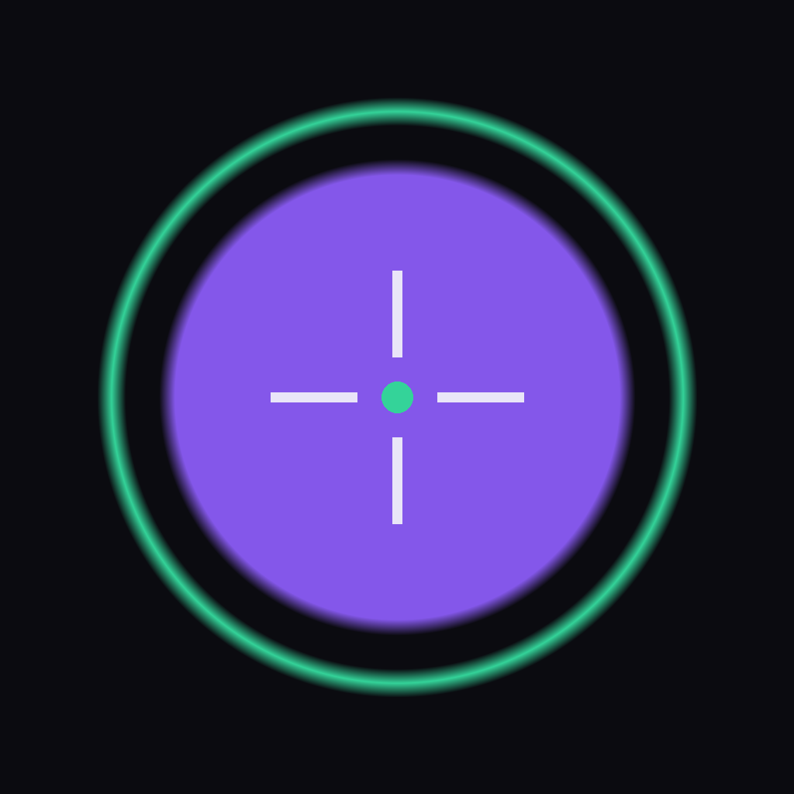

# AI Compose 📷

Eine native iOS **KI-Kamera**, die dir beim Fotografieren live die **optimale
Bildkomposition** und den **passenden Look** vorschlägt. Gebaut für den
Windows-ohne-Mac-Workflow: **Expo (managed) + EAS Build + Sideload**.



## Was die App kann

1. **Vollbild-Rückkamera** mit nativem Objektiv-Zoom `.5x / 1x / 2x / 5x`
   (gemappt über `device.minZoom/neutralZoom/maxZoom`).
2. **Echtzeit-Kompositions-Overlay** – erkennt on-device das Hauptmotiv, zeichnet
   einen farbigen **Ring + Fadenkreuz** und führt dich per **Pfeil** zur idealen
   Position nach der Drittel-Regel. Läuft **rein lokal, keine API-Calls pro Frame**.
3. **"AI Compose"-Button** – schickt **nur beim Antippen** das aktuelle Frame an
   **Gemini Flash** und bekommt strukturiertes JSON zurück (Advice + Fokus + Zoom
   + Filter). Zeigt oben eine **Advice-Pill** und wendet den Look live an.
4. **AI Filter Picks** – die von Gemini vorgeschlagenen Looks als Thumbnails;
   tippen = live anwenden (Skia-Color-Matrix auf die Vorschau).
5. **Auslöser** – nimmt das Foto mit aktuellem Zoom **+ eingebranntem Filter** auf
   und speichert es in die iOS-Fotomediathek.
6. **Settings** – Gemini API-Key (sicher im iOS-Keychain via `expo-secure-store`)
   + Modellwahl (`gemini-3-flash` Standard, `gemini-2.5-flash` Fallback).

## Stack

- **Expo SDK 52** (TypeScript, managed workflow, New Architecture)
- **react-native-vision-camera** v4 – Kamera, Zoom, Frame Processors
- **@shopify/react-native-skia** – Live-Filter (Color-Matrix) auf Vorschau + Foto
- **vision-camera-resize-plugin** + **react-native-worklets-core** – on-device
  Saliency im Frame-Processor-Worklet (keine ML-Modell-Datei nötig)
- **expo-media-library** (speichern), **expo-secure-store** (Key),
  **expo-image-manipulator** / **expo-file-system** (Frame-Encoding)

## Projektstruktur

```
App.tsx                     App-Root (Provider)
src/
  theme.ts                  Design-Tokens (dark, violett/grün)
  components/
    CameraScreen.tsx        Orchestrierung: Feed, Overlay, Compose, Filter, Shutter
    CompositionOverlay.tsx  Drittel-Raster, Ring, Fadenkreuz, Zielmarker, Pfeil
    FilterPicks.tsx         AI-Filter-Thumbnails
    SettingsSheet.tsx       API-Key + Modell
    ComposeButton / ShutterButton / ZoomSelector / AdvicePill / MessageBanner ...
  lib/
    useComposition.ts       Skia-Frame-Processor: on-device Saliency + Live-Filter
    gemini.ts               Gemini-Client, robustes JSON-Parsing, Fehlerklassen
    filters.ts              Filter -> 4x5 Color-Matrix, Presets, Clamping
    photo.ts                Filter ins gespeicherte Foto brennen (Skia offscreen)
    camera.ts               Zoom-Stufe -> nativer VisionCamera-Zoom
    capture.ts              schnelles Frame -> Base64-JPEG für Gemini
    storage.ts / useSettings.ts / types.ts
```

## Loslegen

Kein Mac nötig. Vollständige Schritt-für-Schritt-Anleitung (EAS Build →
`.ipa` → AltStore/Sideloadly, Developer Mode, Auto-Refresh) steht in
**[README_DEPLOY.md](README_DEPLOY.md)**.

Kurzfassung:

```powershell
npm install
eas login
eas init
eas build -p ios --profile preview   # .ipa in der Cloud bauen
# .ipa runterladen -> per AltStore/Sideloadly installieren
```

> **Hinweis:** VisionCamera-Frame-Processors laufen **nicht in Expo Go** – du
> brauchst den EAS-Build (`preview`- oder `development`-Profil).

## Datenschutz

Die Echtzeit-Führung ist **100% on-device**. Nur beim Tippen auf **AI Compose**
geht ein Kamera-Frame an **Google Gemini**. Im **Free-Tier** kann Google diese
Daten **zum Training** nutzen – für private Nutzung ok, aber keine sensiblen
Motive senden. Details in [README_DEPLOY.md](README_DEPLOY.md#-datenschutz-hinweis-wichtig).
